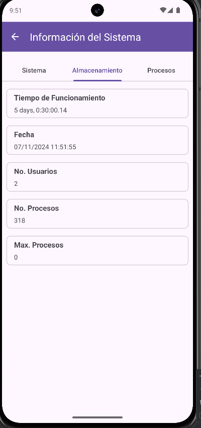

# POR HACER

- [ ] Hacer snmp v2c
- [ ] Hacer snmp getbulk
- [ ] Hacer snmp set - será una opcion de la herramienta operacion snmp

# En proceso
- [ ] Descubrir host por icmp
# Hecho
- [ ] Que cuando guarde un host que se actualize correctamente la lista de hosts
- [ ] Cundo quiere descubrir los host no los esta logrando encontrar
- [ ] Hacer snmp getwalk
- [ ] Validar el swap de los tab view para que
    navegue correctamente entre ellos:
    
- [ ] Validar que no se rompa la app cuando se hace un get con un oid que no existe
- [ ] Hacer snmp getnext
- [ ] En la vista operación snmp cuando se haga un getnext escribir el siguiente oid en el campo
  textfield OID
- [ ] La vista almacenamiento debe mostar el espacio libre y el estado